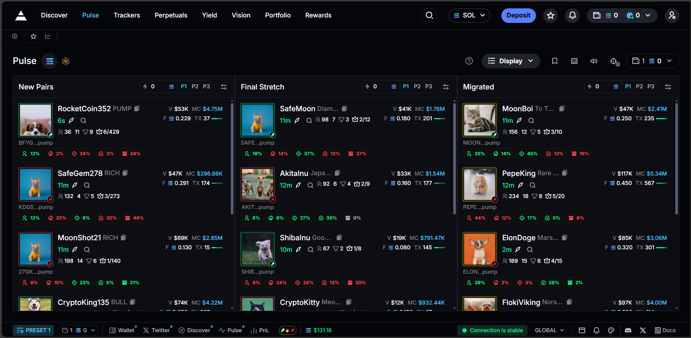
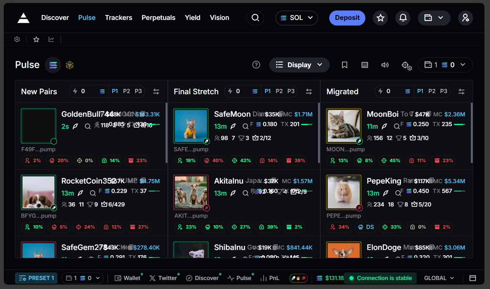
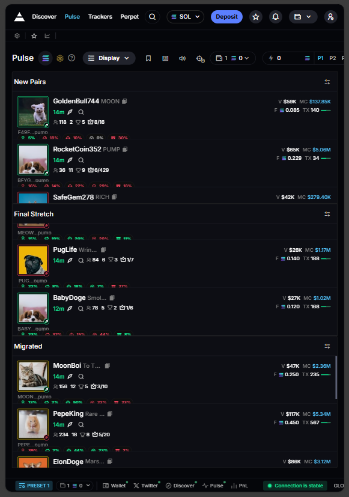
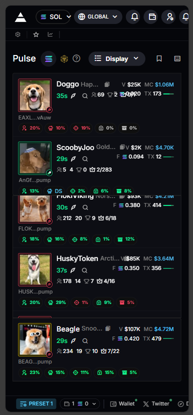
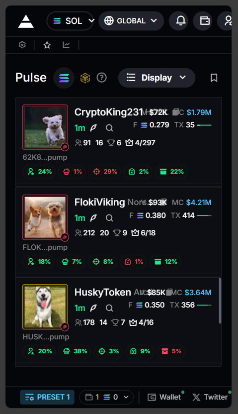

# Axiom Table

A real-time token trading dashboard I built for Eterna Lab's Frontend Placement Task.

Vercel Deployment Link: https://axiom-table-two.vercel.app/

## What is this?

This is a crypto token discovery interface. Tokens flow through three stages:
- **New Pairs** - Fresh tokens just hitting the market
- **Final Stretch** - Tokens approaching their bonding curve completion
- **Migrated** - Fully bonded tokens ready for trading

The whole thing updates in real-time (well, simulated real-time) with smooth transitions and a bunch of visual polish.

## Tech Stack

- Next.js 14 with the new App Router
- TypeScript everywhere
- Tailwind CSS for styling
- Redux Toolkit for state
- Radix UI components (the shadcn/ui collection)
- Remix Icon for icons

## Why I built it this way

### Styling Choices

I used the `Small` metric under the `Display` settings from https://axiom.trade/pulse?chain=sol to use as reference for the sizing/styling of the Token cards as it looked cleaner.

I spent way too much time getting the colors exactly right. The colors are still not a perfect match but they're close enough.

Same with the font choice. I could not find the exact font that https://axiom.trade uses on their website. Instead, I used `Inter` for the entire project.

### Mock WebSocket 

Instead of connecting to a real backend, I built a mock WebSocket service that simulates server updates. This was actually pretty fun to build - it handles:

- Random token additions/removals
- Realistic price fluctuations (±5% for market cap, ±8% for volume)
- Bonding progress that gradually increases
- State transitions (bonding → migrating → migrated)

The mock service lives in `lib/services/websocketService.ts` and honestly got more complex than I initially planned. But it makes the demo feel alive without needing a backend.

### Performance stuff

With updates firing every 2-5 seconds and potentially 30+ tokens on screen, I had to be careful about re-renders:

```typescript
// Memoized everything that doesn't need to re-render
export default memo(TokenCard);
export default memo(TokenMeta);

// Used useCallback for event handlers
const handleClick = useCallback((token: Token) => {
  onClick?.(token);
}, [onClick]);
```

Also using `useMemo` for the token distribution logic since sorting and filtering 30+ items on every render would be wasteful.

### Bonding Progress System

This was probably the most interesting part to implement. Tokens go through a lifecycle:

1. Start with low bonding progress (0-30%)
2. Gradually increase (0.5-2% per update)
3. Hit 100% → status changes to "migrating"
4. After 3-5 seconds → status changes to "migrated"

The tricky part was managing the async transition from migrating to migrated without causing race conditions in the Redux store.

## Project Structure

```
app/                    # Next.js app directory
  ├── globals.css       # All the custom CSS and animations
  ├── layout.tsx        # Root layout with providers
  └── page.tsx          # Main page

components/
  ├── layout/           # Page layout components
  ├── tokens/           # Token card and related components
  ├── modals/           # Dialogs and modals
  └── ui/               # Radix UI primitives

lib/
  ├── services/         # WebSocket, data generation
  ├── redux/            # Store, slices, hooks
  └── utils/            # Helper functions

hooks/                  # Custom React hooks
```

## Some interesting code bits

### Realistic Data Fluctuations

```typescript
// Only fluctuate values 10% of the time
if (Math.random() > 0.9) {
  // Market cap: ±5%
  const mcChange = (Math.random() - 0.5) * 0.1;
  updatedToken.marketCap = Math.max(1000, updatedToken.marketCap * (1 + mcChange));
  
  // Volume: ±8% (more volatile)
  const volChange = (Math.random() - 0.5) * 0.16;
  updatedToken.volume24h = Math.max(100, updatedToken.volume24h * (1 + volChange));
  
  // TX count: ±3 transactions
  const txChange = Math.floor(Math.random() * 7) - 3;
  updatedToken.txCount = Math.max(0, (updatedToken.txCount || 0) + txChange);
}
```

This makes the numbers feel alive without being too chaotic.

### Token Distribution Logic

```typescript
const tokensByColumn = useMemo(() => {
  // First 6 tokens are "new"
  const newTokens = tokens.slice(0, 6);
  
  // Remaining tokens split between final stretch and migrated
  const remaining = tokens.slice(6);
  
  // Final stretch: not yet at 100% or currently migrating
  const finalStretch = remaining
    .filter(t => (t.bondingProgress || 0) < 100 || t.status === "migrating")
    .sort((a, b) => (b.bondingProgress || 0) - (a.bondingProgress || 0))
    .slice(0, 6);
    
  // Migrated: only completed tokens
  const migrated = remaining
    .filter(t => t.status === "migrated")
    .slice(0, 6);

  return { new: newTokens, final: finalStretch, migrated };
}, [tokens]);
```

### The Migrating Overlay

When a token hits 100% bonding, it gets this cool pulsing overlay, I couldn't properly replicate the overlay from the original website but I was short on time so I left it at this:

```typescript
{showOverlay && (
  <div className="absolute inset-0 z-[60] pointer-events-none">
    <div className="absolute inset-0 bg-[#091E36]/80 animate-pulse" />
    <div className="absolute inset-0 bg-gradient-to-r from-transparent via-blue-500/20 to-transparent -translate-x-full animate-[shimmer_1.5s_infinite]" />
  </div>
)}
```

Two layers: a pulsing background + a moving shimmer effect. `pointer-events-none` lets you still interact with the card underneath.

## Running it locally

```bash
npm install
npm run dev
```

Open http://localhost:3000 and you should see tokens updating in real-time.

## Responsive Design

Fully responsive layout that works down to 320px width. The interface adapts seamlessly across all screen sizes:

### Desktop View (1920px+)


### Tablet View (768px - 1024px)


### iPad View (820px - 1180px)


### Mobile View (375px - 767px)


### Small Mobile (320px)


## Things I'd do differently

- The Redux setup is probably overkill for this. Could've just used React Context or even local state but Redux was one of the requirements for this task.
- Should've added proper error boundaries earlier instead of as an afterthought.
- The mock WebSocket service got pretty complex - might've been cleaner to use a library like MSW.
- I didn't get a chance to write any tests.


Tried to finish everything under a day as my endsems are still ongoing. Feel free to poke around the code!
